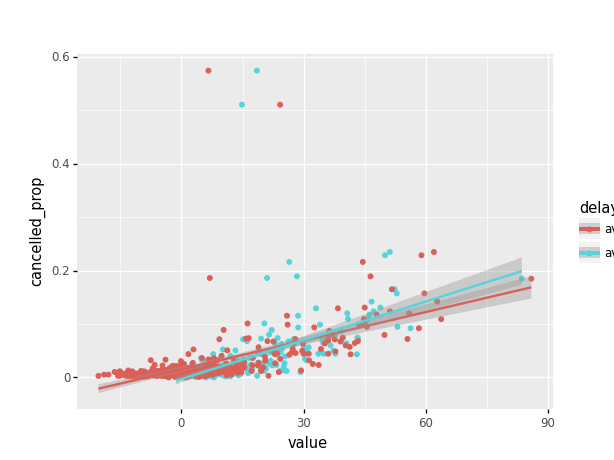
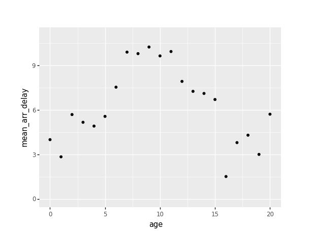

# A tour of tidypandas

------------------------------------------------------------------------

> The intent of this document is to illustrate some standard data
> manipulation exercises using `tidypandas` python package. We use the
> `nycflights13` data.

------------------------------------------------------------------------

> [`tidypandas`](https://github.com/talegari/tidypandas) – A **grammar
> of data manipulation** for
> [pandas](https://pandas.pydata.org/docs/index.html) inspired by
> [tidyverse](https://tidyverse.tidyverse.org/)

------------------------------------------------------------------------

`nycflights13` contains information about all flights that departed from
NYC (e.g. EWR, JFK and LGA) to destinations in the United States, Puerto
Rico, and the American Virgin Islands) in 2013: 336,776 flights in
total. To help understand what causes delays, it also includes a number
of other useful datasets.

-   flights: all flights that departed from NYC in 2013
-   weather: hourly meteorological data for each airport
-   planes: construction information about each plane
-   airports: airport names and locations
-   airlines: translation between two letter carrier codes and names

## Imports

    from tidypandas import tidyframe
    from tidypandas.series_utils import *
    from plotnine import *

    # for plotnine: some column need downcasting from nullable types
    def downcast_dtypes(pdf):
        from pandas.api import types
        cn = list(pdf.columns)
        pdf2 = pdf.copy()
        for acolname in cn:
            if types.is_numeric_dtype(pdf[acolname]):
                pdf2[acolname] = pd.to_numeric(pdf2[acolname].astype('string'), downcast = 'integer')
        return pdf2

## Load and Display `flights` data

    from nycflights13 import flights, planes
    flights_tidy = tidyframe(flights)
    print(flights_tidy)

    ## # A tidy dataframe: 336776 X 19
    ##      year   month     day  ...    hour  minute             time_hour
    ##   <Int64> <Int64> <Int64>  ... <Int64> <Int64>              <string>
    ## 0    2013       1       1  ...       5      15  2013-01-01T10:00:00Z
    ## 1    2013       1       1  ...       5      29  2013-01-01T10:00:00Z
    ## 2    2013       1       1  ...       5      40  2013-01-01T10:00:00Z
    ## 3    2013       1       1  ...       5      45  2013-01-01T10:00:00Z
    ## 4    2013       1       1  ...       6       0  2013-01-01T11:00:00Z
    ## 5    2013       1       1  ...       5      58  2013-01-01T10:00:00Z
    ## 6    2013       1       1  ...       6       0  2013-01-01T11:00:00Z
    ## 7    2013       1       1  ...       6       0  2013-01-01T11:00:00Z
    ## 8    2013       1       1  ...       6       0  2013-01-01T11:00:00Z
    ## 9    2013       1       1            6       0  2013-01-01T11:00:00Z
    ## #... with 336766 more rows

## Exercise: Find all flights that arrived more than two hours late, but didn’t leave late.

    out = (flights_tidy.filter("dep_delay <= 0 and arr_delay > 120")
                       .select(['flight', 'dep_delay', 'arr_delay'])
                       )
    print(out)

    ## # A tidy dataframe: 29 X 3
    ##    flight  dep_delay  arr_delay
    ##   <Int64>    <Int64>    <Int64>
    ## 0    3728         -1        124
    ## 1    5181          0        130
    ## 2    1151         -2        124
    ## 3       3         -3        122
    ## 4     399         -2        194
    ## 5     389         -3        140
    ## 6    4540         -5        124
    ## 7     707         -2        179
    ## 8    2083         -5        143
    ## 9    4674         -3        127
    ## #... with 19 more rows

## Exercise: Sort flights to find the fastest flights

    out = (flights_tidy.mutate({'speed': (lambda x, y: x/y, ['distance', 'air_time'])})
                       .arrange([('speed', 'desc')])
                       .select(['flight', 'dep_delay', 'arr_delay', 'speed'])
                       )
    print(out)

    ## # A tidy dataframe: 336776 X 4
    ##    flight  dep_delay  arr_delay      speed
    ##   <Int64>    <Int64>    <Int64>  <Float64>
    ## 0    1499          9        -14  11.723077
    ## 1    4667         45         26   10.83871
    ## 2    4292         15         -1       10.8
    ## 3    3805          4          2  10.685714
    ## 4    1902         -1        -28   9.857143
    ## 5     315         -5        -51        9.4
    ## 6     707         -3        -26   9.290698
    ## 7     936         -1        -43   9.274286
    ## 8     347          1        -32   9.236994
    ## 9     329         -2        -39   9.236994
    ## #... with 336766 more rows

## Exercise: Is the proportion of cancelled flights related to the average delay?

    out = (flights_tidy
            .mutate({'cancelled': (lambda x, y: (pd.isna(x) | pd.isna(y)),
                                   ['arr_delay', 'dep_delay']
                                  )
                    }
                   )
            .summarise({'cancelled_prop': (np.mean, 'cancelled'),
                        'avg_dep_delay': (np.mean, 'dep_delay'),
                        'avg_arr_delay': (np.mean, 'arr_delay')
                       },
                       by = ['year', 'month', 'day']
                      )
            )
                            
    print(out)

    ## # A tidy dataframe: 365 X 6
    ##      year   month     day  cancelled_prop  avg_dep_delay  avg_arr_delay
    ##   <Int64> <Int64> <Int64>       <Float64>      <Float64>      <Float64>
    ## 0    2013       1       1        0.013064      11.548926      12.651023
    ## 1    2013       1       2        0.015907      13.858824      12.692888
    ## 2    2013       1       3        0.015317      10.987832       5.733333
    ## 3    2013       1       4         0.00765       8.951595      -1.932819
    ## 4    2013       1       5        0.004167       5.732218      -1.525802
    ## 5    2013       1       6        0.003606       7.148014       4.236429
    ## 6    2013       1       7        0.003215       5.417204      -4.947312
    ## 7    2013       1       8        0.007786       2.553073      -3.227578
    ## 8    2013       1       9        0.009978       2.276477      -0.264278
    ## 9    2013       1      10        0.003219       2.844995      -5.898816
    ## #... with 355 more rows

    data_for_plot = (out.pivot_longer(cols = ['avg_dep_delay', 'avg_arr_delay'],
                                      names_to = "delay_type"
                                      )
                        )
    print(data_for_plot)

    ## # A tidy dataframe: 730 X 6
    ##       day   month  cancelled_prop    year     delay_type      value
    ##   <Int64> <Int64>       <Float64> <Int64>       <string>  <Float64>
    ## 0       1       1        0.013064    2013  avg_dep_delay  11.548926
    ## 1       2       1        0.015907    2013  avg_dep_delay  13.858824
    ## 2       3       1        0.015317    2013  avg_dep_delay  10.987832
    ## 3       4       1         0.00765    2013  avg_dep_delay   8.951595
    ## 4       5       1        0.004167    2013  avg_dep_delay   5.732218
    ## 5       6       1        0.003606    2013  avg_dep_delay   7.148014
    ## 6       7       1        0.003215    2013  avg_dep_delay   5.417204
    ## 7       8       1        0.007786    2013  avg_dep_delay   2.553073
    ## 8       9       1        0.009978    2013  avg_dep_delay   2.276477
    ## 9      10       1        0.003219    2013  avg_dep_delay   2.844995
    ## #... with 720 more rows

    (ggplot(downcast_dtypes(data_for_plot.to_pandas()),
            aes('value', 'cancelled_prop', color = 'delay_type')
            ) +
        geom_point() +
        geom_smooth(method = "lm")
        )

    ## <ggplot: (8751366103836)>

## Exercise: Find all destinations that are flown by at least two carriers. Use that information to rank the carriers.

    out = (flights_tidy.mutate({'n_carriers': (n_distinct, 'carrier')}, by = 'dest')
                       .filter('n_carriers > 1')
                       .summarise({'n_dest': (n_distinct, 'dest')}, by = 'carrier')
                       .arrange([('n_dest', 'desc')])
                       )
    print(out)

    ## # A tidy dataframe: 16 X 2
    ##    carrier  n_dest
    ##   <string> <Int64>
    ## 0       EV      51
    ## 1       9E      48
    ## 2       UA      42
    ## 3       DL      39
    ## 4       B6      35
    ## 5       AA      19
    ## 6       MQ      19
    ## 7       WN      10
    ## 8       US       5
    ## 9       OO       5
    ## #... with 6 more rows

## Exercise: Is there a relationship between the age of a plane and its delays?

    planes_tidy = tidyframe(planes)
    print(planes_tidy)

    ## # A tidy dataframe: 3322 X 9
    ##    tailnum    year                     type  ...   seats   speed     engine
    ##   <string> <Int64>                 <string>  ... <Int64> <Int64>   <string>
    ## 0   N10156    2004  Fixed wing multi engine  ...      55    <NA>  Turbo-fan
    ## 1   N102UW    1998  Fixed wing multi engine  ...     182    <NA>  Turbo-fan
    ## 2   N103US    1999  Fixed wing multi engine  ...     182    <NA>  Turbo-fan
    ## 3   N104UW    1999  Fixed wing multi engine  ...     182    <NA>  Turbo-fan
    ## 4   N10575    2002  Fixed wing multi engine  ...      55    <NA>  Turbo-fan
    ## 5   N105UW    1999  Fixed wing multi engine  ...     182    <NA>  Turbo-fan
    ## 6   N107US    1999  Fixed wing multi engine  ...     182    <NA>  Turbo-fan
    ## 7   N108UW    1999  Fixed wing multi engine  ...     182    <NA>  Turbo-fan
    ## 8   N109UW    1999  Fixed wing multi engine  ...     182    <NA>  Turbo-fan
    ## 9   N110UW    1999  Fixed wing multi engine          182    <NA>  Turbo-fan
    ## #... with 3312 more rows

    planes_year_frame = (planes_tidy.select(['tailnum', 'year'])
                                    .rename({'year': 'plane_year'})
                                    )
    print(planes_year_frame)

    ## # A tidy dataframe: 3322 X 2
    ##    tailnum  plane_year
    ##   <string>     <Int64>
    ## 0   N10156        2004
    ## 1   N102UW        1998
    ## 2   N103US        1999
    ## 3   N104UW        1999
    ## 4   N10575        2002
    ## 5   N105UW        1999
    ## 6   N107US        1999
    ## 7   N108UW        1999
    ## 8   N109UW        1999
    ## 9   N110UW        1999
    ## #... with 3312 more rows

    age_delay_stats_frame = \
      (flights_tidy.inner_join(planes_year_frame, on = 'tailnum')
                   .mutate({'age': ('x - y', ['year', 'plane_year'])})
                   .filter(lambda x: ~ pd.isna(x['age']))
                   .mutate({'age_25': lambda x: ifelse(x['age'] > 25, 25, x['age'])})
                   .summarise(column_names = ['arr_delay', 'dep_delay'],
                              func = np.mean,
                              prefix = 'mean_',
                              by = 'age'
                              )
                   )
    print(age_delay_stats_frame)

    ## # A tidy dataframe: 46 X 3
    ##       age  mean_arr_delay  mean_dep_delay
    ##   <Int64>       <Float64>       <Float64>
    ## 0      14        7.117146       13.079679
    ## 1      15        6.709817       13.429565
    ## 2      23         5.69489       11.504746
    ## 3       1        2.850889        9.642778
    ## 4      22         4.17795       10.674242
    ## 5      13        7.259624       11.734242
    ## 6       9       10.243436       16.387705
    ## 7       2        5.696238       11.840951
    ## 8       6        7.540417        13.73795
    ## 9       5        5.572951       13.158852
    ## #... with 36 more rows

    (ggplot(age_delay_stats_frame.to_pandas().pipe(downcast_dtypes), aes('age', 'mean_arr_delay')) +
         geom_point() +
         xlim(0, 20) +
         ylim(0, 11)
         )

    ## <ggplot: (8751365834072)>
    ## 
    ## /home/dattachidambara/.cache/pypoetry/virtualenvs/tidypandas-cfuMUHaV-py3.8/lib/python3.8/site-packages/plotnine/layer.py:401: PlotnineWarning: geom_point : Removed 25 rows containing missing values.

